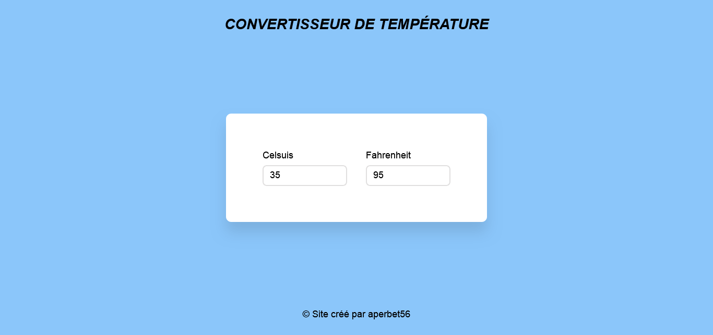

## CONVERTISSEUR DE TEMPERATURE

## Le challenge

Ce site permet vous permet de convertir les degrés Celsius en Fahrenheit mais également les Fahrenheit en Celsius.

## Démonstration

Lien vers le projet : https://aperbet56.github.io/convertisseur_de_temperature/

## Projet développé avec

- Utilisation des balises sémantiques HTML5
- CSS3
- Flexbox
- Animation css (transition)
- Utilisation d'un normaliseur : le fichier normalize.css
- Page web responsive
- Desktop first
- JavaScript
- Code JavaScript commenté
